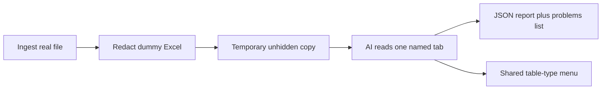

# LLM enrichment v1: inspectable JSON report and shared type menu

Enrichment v1 asks an external model to read **one named tab** of a number-redacted workbook and return an **inspectable JSON report** you can open beside the sheet. The report proposes regions, purpose, display names, types, and cell labels — but **nothing becomes official on the workbook or in the database** in this slice. This refines [ADR 0008](0008-send-a-number-redacted-sheet-to-external-models.md) (redacted export as LLM input) and [ADR 0009](0009-fm-loader-only-llm-owns-semantics.md) (LLM owns semantics) without reopening the heuristic region stack or DB write-back.

## Flow

1. Ingest the real workbook and export a number-redacted `.xlsx` (`tev-parse redact`, ADR 0008).
2. Build a **temporary unhidden copy** of the redacted file for the LLM call. Hidden rows and columns are visible in this copy so backup tables and off-screen structure are not invisible to the model. The original client file and the normal redacted export stay unchanged.
3. Send **one named tab** (`--sheet`) to the external model.
4. Write a **JSON enrichment report** plus a **problems list**. The command **fails** if any problems exist so a messy run is not treated as clean.

## Region geometry

The model proposes **one box per distinct table** — Land breakup, Civil breakup, a check island. Not a parent wrapping children. The sheet title is not its own box unless it is itself a table. A box includes the table's **title, unit banner, headers, and all cells that belong to it**. "(Rs. in Lakhs)" above Civil Cost is **inside** Civil Cost, not a second box.

**Coverage.** Every **filled** cell on the tab sits in **exactly one** box. No overlaps, no silent gaps. Shared header rows are assigned to one table, not both.

## Region purpose

Each box has a **purpose**:

- **Required** — live tables the appraisal should use.
- **Scratch** — unused working calculations (check totals, trial formulas). Nothing Required points at them.
- **Orphan** — unused leftovers from older versions, **and** stray comments that belong to no table (e.g. A3 "Notes: GST extra" far from any table).

**Hard reclassify.** If a Required table's formula references another box, that other box **cannot** stay Scratch or Orphan; it becomes Required (its own small table unless it clearly belongs inside the caller). The report may still note "looks like rough work but is used."

## Annotation

**Annotation** is a **cell role inside a table**, not a kind of box. Banners, footnotes, "as per quotation…" inside Civil Cost are tagged Annotation. Floating comments with no table → Orphan.

## Naming and shared type menu

Each box has:

- a **display name** from the heading (e.g. "Civil Cost Breakup as per Quotation dt 12.04.24")
- a **type** from a **single shared menu** for all TEV files (e.g. Civil Cost)

The model **must reuse** an existing type if the meaning matches. "Civil", "Civil Cost", and "Civil Works" are the same type if one of them is already on the menu — **synonym matching, not duplicate minting**. It **only invents a new type** when nothing current fits. New types are **added to the shared menu immediately** so the next file sees them. Over time, new inventions should fall toward zero. There is **no "Other"** dump — that would fight this rule.

### Starter type menu

Project Cost, Capital Cost, Civil Cost, Land, Plant and Machinery, P&L, Balance Sheet, Cash Flow, Working Capital, Depreciation, Interest, Sales, Assumptions, IRR, Break-even, CMA, Tax, Manpower, Power.

(This list is a starting point; the spec may refine it. The menu grows from model proposals, not from a fixed enum.)

## Cell labels (Required tables only)

**Amount cells** (dummy numbers and formulas) in Required regions get:

- address (e.g. B4)
- rowLabel (Structure), optional parentRowLabel (e.g. Revenue above Rooms)
- columnLabel (Year 1), optional parentColumnLabel (e.g. Construction period above Year 1–3)
- which table they belong to (display name / type)

**Title, Annotation, row headers, and column headers** are listed with a **role** (`title` / `annotation` / `rowHeader` / `columnHeader`) and **do not** get invented row/column names. Totals are treated as amount cells (rowLabel "Total", etc.); we do **not** stamp a separate "this is a total" flag in this slice.

## Violations and QA

When the model breaks partition or reclassify rules, still write the JSON with a **problems list** (overlap, unassigned cell, Scratch still used by Required). The command **fails** if any problems exist. We do **not** silently move boxes to "fix" the model. If QA finds `unassigned_cell`, we run **one cropped repair pass**: leftover filled cells plus nearby existing regions (proximity crops the prompt; it does not decide membership). Frozen regions are not sent. The model may expand nearby boxes or add new ones. Java merges that patch over the first report and keeps the result only when QA is clean. A dirty repair does not replace the first. Overlap-only failures do not trigger repair. We do not resample the full sheet.

**How we will say it worked.** One real tab you care about (e.g. Project Cost or P&L). Pass if: each real table is one box including title and headers; scratch/leftovers look right; a dozen amount cells have the right row/column names. Not a 16,000-cell perfect score.

## Tiny example (Civil Cost)

One Required box covering A1:D6, type Civil Cost, display name "Civil Cost Breakup".

- A1 title, A2 Annotation ("Rs. in Lakhs"), row 3 column headers, column A row headers
- B4 (100) → row Structure, column Year 1
- Floating A3 "Notes: GST extra" (if it sat far away) → its own Orphan box
- A check island used by the Total formula → Required, not Scratch

## Explicitly deferred

- Writing labels into the database as official truth
- Analyst accept/reject UI (`review_queue` write-back)
- All tabs in one run
- Nested parent/child boxes
- Mapping tables onto cost heads (CIVIL, HVAC, …)
- Rule-based / heuristic region detection (rejected in ADR 0009; the model proposes regions)

## Relationship to prior ADRs

- **Refines ADR 0008:** redacted export was always LLM input; this ADR defines what the first LLM step returns (JSON report, not merged workbook).
- **Supplements ADR 0009:** semantic ownership stays with the external model; v1 stops at an inspectable proposal. DB write-back and analyst review are later steps on the same ownership model.
- **Does not reopen** ADR 0004–0006 or the heuristic stack superseded by ADR 0009.
